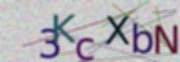

# My Captcha

It's a simple and lightweight program to generate captcha pictures in python programming language.

## Getting Started

### Prerequisites

In this program we use **PIL (python Image library)** libraries of python which you can easily install using pip.

```
$ pip install Pillow
```

## Usage

To use this program you only need to run it using  python interpreter.

```
$ python myCaptcha.py
```

### Examples



## License

This project is licensed under the GPL - see the LICENSE file for details


## Contribute

As you can see, this program is still under manufacture, so fell free to help me make this program more efficient and better.

thank you all
